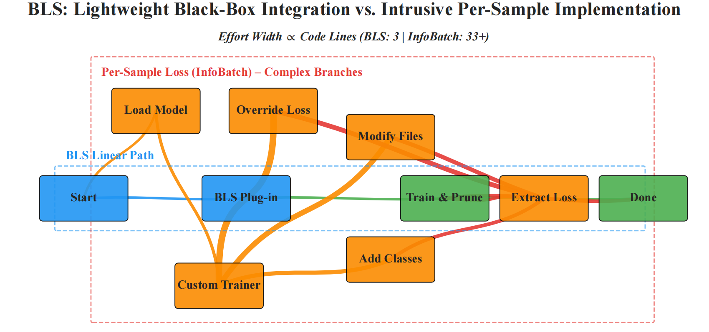
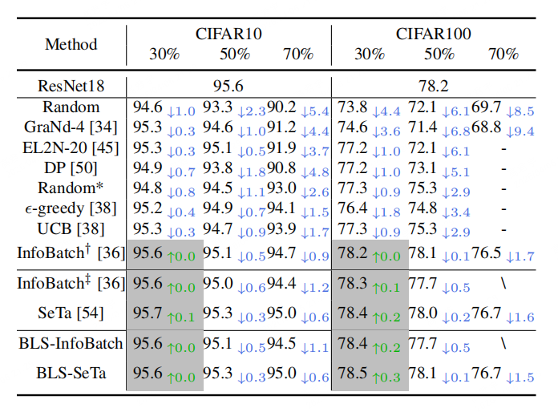

<h2 align="center">Batch Loss Score for Dynamic Data Pruning</h2>
<p align="center"><b>CVPR 2026</b> | <a href="https://arxiv.org/pdf/2604.04681">[Paper]</a> | <a href="https://github.com/mrazhou/BLS">[Code]</a> </p>

**BLS** is a computationally efficient alternative using an Exponential Moving Average (EMA) of readily available batch losses to assign scores to individual samples. By treating batch loss as a noisy measurement of scaled individual loss, it acts as a low-pass filter to attenuate batch composition noise. 

* 🎯 **EMA-Filtered Scoring:** Infers sample importance directly from mean batch losses, bypassing the intrusive extraction of per-sample losses.
* 🛠️ **Seamless Integration:** Features a conceptual **one-line proxy** and **three-line injection** to instantly adapt existing per-sample frameworks (e.g., InfoBatch, SeTa).
* ⚡ **High Efficiency & Generalization:** Losslessly prunes 20%-50% of samples across 14 datasets, 11 tasks, and 18 diverse architectures (including CNNs, Transformers, Mamba, and YOLOv5).

> Supported pruning methods: **InfoBatch and SeTa**.

<p align="center">
  
</p>

### Installation
```bash
pip install git+https://github.com/mrazhou/BLS
```
Or you can clone this repo and install it locally.

```bash
git clone https://github.com/mrazhou/BLS
cd BLS
pip install -e .
```


### Usage: 1-Line Proxy & 3-Line Injection

BLS provides a lightweight, black-box integration alternative to traditional, highly intrusive per-sample loss implementations.

To adapt your training loop (e.g., using InfoBatch or SeTa), apply the following minimal modifications:

```python
from BLS import BLS
from infobatch import InfoBatch # or SeTa

# 🌟 1. ONE-LINE PROXY: Wrap base framework
DataHandler = BLS(InfoBatch(train_data, args), alpha=0.7).proxy()

# 🌟 2. INJECT SAMPLER
train_loader = DataLoader(DataHandler, sampler=DataHandler.sampler, batch_size=64)

for epoch in range(args.epochs):
    for images, targets in train_loader:
        loss = criterion(model(images), targets) # Standard mean batch loss
        
        # 🌟 3. PROXIED UPDATE
        loss_final = DataHandler.update(loss)
        loss_final.backward()
        optimizer.step()
```


### Experiment
In this repository, we provide two examples to demonstrate the usage of BLS. 
**CIFAR10/CIFAR100 (support resnet18/50/101) and ImageNet (support various CNNs/Transformers/Mamba)** are used as the datasets.

- CIFAR10/CIFAR100 (*for exploratory research.*)
```bash
# For InfoBatch
bash scripts/cifar.sh BLS_InfoBatch 0.5

# For SeTa
bash scripts/cifar.sh BLS_SeTa 0.1 5 0.9
```


- ImageNet (*for large-scale and cross-architecture comprehensive validation.*)
```bash
# For CNNs
bash scripts/imagenet.sh BLS_InfoBatch mobilenetv3_small_050
bash scripts/imagenet.sh BLS_SeTa mobilenetv3_small_050

# For Transformers
bash scripts/imagenet.sh BLS_InfoBatch vit_tiny_path16_224
bash scripts/imagenet.sh BLS_SeTa vit_tiny_path16_224

# For Vim
# refer to https://github.com/hustvl/Vim for more details
```


<p align="center">
  
</p>

### Citation
If you find this repository helpful, please consider citing our paper:
```bibtex
@inproceedings{zhou2026batch,
  title={Batch Loss Score for Dynamic Data Pruning},
  author={Zhou, Qing and Zhao, Bingxuan and Yang, Tao and Zhang, Hongyuan and Gao, Junyu and Wang, Qi},
  booktitle={CVPR},
  year={2026}
}
@inproceedings{zhou2025scale,
  title={Scale Efficient Training for Large Datasets},
  author={Zhou, Qing and Gao, Junyu and Wang, Qi},
  booktitle={CVPR},
  year={2025}
}
```

and the original InfoBatch paper:

```bibtex
@inproceedings{qin2024infobatch,
  title={InfoBatch: Lossless Training Speed Up by Unbiased Dynamic Data Pruning},
  author={Qin, Ziheng and Wang, Kai and Zheng, Zangwei and Gu, Jianyang and Peng, Xiangyu and Xu, Zhaopan and Zhou, Daquan and Shang, Lei and Sun, Baigui and Xie, Xuansong and You, Yang},
  booktitle={The Twelfth International Conference on Learning Representations},
  year={2024}
}
```